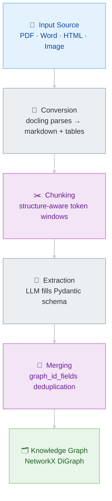
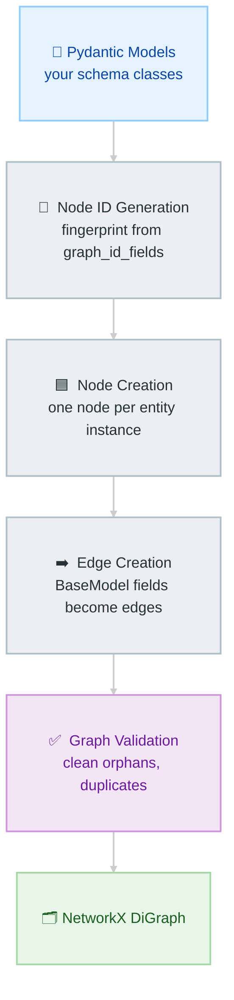

# From PDFs to Knowledge Graphs
## Introduction to docling-graph
**AMLC 2026 · Saturday April 18 · 3:30 pm**

---

# 👉 https://tinyurl.com/docling-graph

```
git clone https://github.com/KrishnaRekapalli/docling-graph-tutorial
cd docling-graph-tutorial
uv sync --python 3.11
```

---

## The Problem

Traditional RAG — embed the document, retrieve the closest chunks — gets you to the right neighborhood. It doesn't give you the structured answer.

> *"List every coverage on this home insurance policy with its limit and premium."*

- **Traditional RAG** → splits the document into text chunks, finds the ones closest to the query by cosine similarity. Returns prose. Requires parsing. May miss entries near chunk boundaries.
- **Graph** → `[(d['coverage_code'], d['limit'], d['premium']) for _, d in G.nodes(data=True) if d['__class__'] == 'Coverage']` → 7 clean rows. Every one. Always complete.

**These are complementary, not competing.** A router sends structured questions to the graph, semantic questions to RAG. Today we build the graph half.

---

## What is docling?

Open-source document parsing library from **IBM Research** (MIT licensed).

- Converts PDFs, Word, HTML, scanned images → clean markdown, structured tables, headings
- Handles complex multi-column layouts, dense forms, tables that naive parsers mangle
- Powers the document understanding layer underneath docling-graph

> "docling reads the document so the LLM doesn't have to figure out where one table ends and the next begins."

---

## What is docling-graph?

Builds on docling to extract **typed, relational structure** — not text chunks, but nodes and edges.

**The full pipeline:**



1. **docling** parses the PDF → clean markdown + structured tables
2. Your **Pydantic schema** tells the LLM what to extract
3. **LLM** fills the schema from the document text
4. **docling-graph** walks the schema tree → builds a NetworkX directed graph
5. You get back `ctx.knowledge_graph` — a queryable Python graph

The entire API surface for the happy path:

```python
ctx = run_pipeline(config)
G   = ctx.knowledge_graph   # networkx.DiGraph, ready to query
```

---

## What You'll Build Today

| Notebook | Document | Concepts |
|---|---|---|
| `01_quickstart` | Home insurance (1 page) | Full pipeline, schema → graph, query, traditional RAG comparison |
| `02_schema` | NVIDIA earnings (~5 pages) | Schema design, chunking, graph_id_fields, exercises |
| `03_export` | Same graphs | CSV/Cypher export, Neo4j |
| `04_vlm_path` *(optional)* | Home insurance | VLM backend, no API key, GPU required |

Home insurance runs locally with gemma4-8k — no API key needed. NVIDIA earnings uses gpt-4o-mini (set `OPENAI_API_KEY` in `.env`). If setup isn't complete or you don't have an API key: `uv run python load_prerun.py` loads pre-extracted graphs so you can follow every query and visualization section.

---

## The One Trick

> **One Pydantic model defines both the extraction prompt AND the graph structure.**  
> You write it once. You get both for free. No separate ontology. No mapping step.

```python
class Coverage(BaseModel):
    coverage_code: str          # ← attribute on the Coverage node
    coverage_name: str          # ← attribute on the Coverage node
    limit:   Optional[str]      # ← attribute on the Coverage node
    premium: Optional[str]      # ← attribute on the Coverage node

class HomePolicy(BaseModel):
    policy_number:  str         # ← attribute on the HomePolicy node
    total_premium:  Optional[str]

    insurer:     Optional[Insurer]    # ← edge: HomePolicy ──► Insurer node
    coverages:   List[Coverage]       # ← edges: HomePolicy ──► Coverage node ×7
    deductibles: List[Deductible]     # ← edges: HomePolicy ──► Deductible node ×3
```

**The rule:** field typed as a `BaseModel` → graph edge + new node. Scalar field → node attribute.

- `Optional[Insurer]` — 0 or 1 insurer. The policy has at most one.
- `List[Coverage]` — 0 to many coverages. One edge and one node per coverage found.

---

## Schema → Graph

```
HomePolicy (node)
  ├── policy_number = "FHO295000"       ← attribute
  ├── total_premium = "$854.00"         ← attribute
  │
  ├──[insurer]──────► Insurer           ← edge → new node
  ├──[coverages]────► Coverage A        ← edge → new node
  ├──[coverages]────► Coverage B        ← edge → new node
  ├──[coverages]────► Coverage C        ← edge → new node
  └──[deductibles]──► Deductible        ← edge → new node
```

Each `BaseModel` class = one node type. Referencing it from another model = an edge. The schema defines what *can* exist; the document determines what *does* exist.

---

## Two Extraction Paths

| | LLM path | VLM path |
|---|---|---|
| Input | PDF → markdown → LLM | PDF → page images → vision model |
| Best for | Text-heavy, standard layouts | Scanned docs, complex forms, sensitive data |
| API key | Optional (Ollama runs locally) | Never needed |
| GPU | No | Yes |
| Today | ✓ | Notebook 04 (optional) |

**Today:** home insurance uses the LLM path with **gemma4-8k** locally via Ollama. NVIDIA earnings uses **gpt-4o-mini** via OpenAI (multi-page doc — remote model handles it better).

---

## Graphs + Traditional RAG: The Hybrid Pattern

```
User question
      │
      ▼
   Router
   /           \
Graph       Traditional RAG
  │               │
structured      semantic
questions       questions
```

| Route to graph | Route to traditional RAG |
|---|---|
| "How many coverages?" | "Explain the risks in section 3" |
| "List all X with Y" | "Summarize this document" |
| "Which partner deploys Blackwell?" | "What did the CEO say about Z?" |
| "Compare limits across coverages" | Open-ended semantic search |

Both read the same source documents. The graph wins on counting, listing, filtering, and traversal. Traditional RAG wins on explanation and open-ended questions. Use both.

---

## Advanced Concepts

### Deduplication: graph_id_fields

When a multi-page document is chunked, the same entity appears in multiple chunks. Without deduplication:

```
Chunk 1 → BusinessSegment(name="Data Center", revenue="$35.6B")
Chunk 3 → BusinessSegment(name="Data Center", revenue_growth_yoy="112%")

Without graph_id_fields → 2 separate incomplete nodes
With    graph_id_fields → 1 merged node with all fields
```

```python
class BusinessSegment(BaseModel):
    model_config = ConfigDict(graph_id_fields=["name"])  # ← dedup key
    name: str
    revenue: str
    revenue_growth_yoy: str
```

docling-graph fingerprints the `graph_id_fields` values → stable node ID. Same name across chunks = same node. Missing this is the most common source of duplicate nodes.

How the converter processes models:



---

### Extraction Contracts

`extraction_contract` controls **how many LLM calls are made**.

| Contract | When to use | How it works |
|---|---|---|
| `direct` | Single-page docs (≤1 page) | 1 LLM call on the full document |
| `delta` | Multi-page docs | N calls (one per chunk) → merge → quality gate → fallback to direct if gate fails |
| `staged` | Very complex schemas | 3-pass: ID discovery → property fill → merge |

**Today:** home insurance uses `direct`. NVIDIA earnings uses `delta`.

The delta flow — including the quality gate fallback:

```mermaid
%%{init: {'theme': 'redux-dark', 'look': 'default'}}%%
flowchart TB
    classDef input fill:#E3F2FD,stroke:#90CAF9,color:#0D47A1,font-size:16px,padding:10px
    classDef config fill:#FFF8E1,stroke:#FFECB3,color:#5D4037,font-size:16px,padding:10px
    classDef output fill:#E8F5E9,stroke:#A5D6A7,color:#1B5E20,font-size:16px,padding:10px
    classDef data fill:#EDE7F6,stroke:#B39DDB,color:#4527A0,font-size:16px,padding:10px
    classDef operator fill:#F3E5F5,stroke:#CE93D8,color:#6A1B9A,font-size:16px,padding:10px
    classDef process fill:#ECEFF1,stroke:#B0BEC5,color:#263238,font-size:16px,padding:10px

    n1["📄 Source Chunks"]
    n2["⚙️ Delta Template Config"]
    n3["📦 Batch Planning\ngroup chunks that fit the token budget"]
    n3a["🗜️ Greedy Token Packing\nfill each batch as full as possible\nwithout exceeding chunk_max_tokens"]
    n4["🤖 Per-batch LLM Call\nextract entities from each batch"]
    n5["🗃️ Raw DeltaGraph\nflat list of extracted nodes + ids"]
    n6["🔧 IR Normalization\nclean LLM output: validate schema paths,\ncanonicalise id values, strip hallucinated\nnested properties"]
    n7["🔗 Graph Merge & Deduplication\nmerge nodes with same graph_id_fields\nacross all batches into one node"]
    n8["🔍 Resolvers (Optional)\nfuzzy/semantic matching to merge\nnodes the LLM named slightly differently"]
    n9["🪪 Identity Filter (Optional)\ndrop nodes whose id fields are\ntoo similar to be distinct entities"]
    n10["📐 Projection\nrebuild the Pydantic-shaped root object\nfrom the flat merged node list"]
    n11["✅ Quality Gate\n10 checks on the merged result\nfail → discard and retry as direct"]
    n12["🔄 Direct Extraction Fallback\nsend full document in one LLM call"]
    n13["🗂️ Final Result"]

    n1 & n2 --> n3
    n3 --> n3a --> n4 --> n5 --> n6 --> n7 --> n8 --> n9 --> n10 --> n11
    n11 -- "Pass" --> n13
    n11 -- "Fail" --> n12 --> n13

    class n1 input
    class n2 config
    class n5 data
    class n3,n7,n10,n11,n3a,n6 process
    class n4,n8,n9,n12 operator
    class n13 output
```



**Quality gate checks — what each one catches:**

| # | Check | Fails when… | What it means |
|---|---|---|---|
| ① | `missing_root_instance` | Root entity (e.g. `NvidiaEarnings`) never extracted | LLM missed the top-level entity entirely — graph is unrooted |
| ② | `insufficient_instances` | Attached node count < `quality_min_instances` | Extraction returned almost nothing — not worth keeping |
| ③ | `parent_lookup_miss` | Too many child nodes couldn't find their parent during merge | Chunks didn't overlap enough; entity context was split |
| ④ | `unknown_path_dropped` | LLM put entities in schema fields that don't exist | Hallucinated structure — LLM invented field names |
| ⑤ | `id_key_mismatch` | `graph_id_fields` values didn't match across chunks | Deduplication broke — same entity got different IDs per batch |
| ⑥ | `nested_property_dropped` | LLM returned nested objects where flat strings were expected | Schema mismatch — local models often do this on complex fields |
| ⑦ | `missing_relationship_attachments` | No list items attached (no one-to-many edges) | All `List[Model]` fields came back empty |
| ⑧ | `missing_structural_attachments` | No node attachments of any kind | Extraction produced nodes but none connected to anything |
| ⑨ | `orphan_ratio_exceeded` | Too many nodes have no edges | Graph is disconnected — merge failed to link children to parents |
| ⑩ | `canonical_identity_duplicates` | Same entity extracted multiple times with different canonical IDs | `graph_id_fields` not stable — entity named differently per chunk |

If **any** check fails → entire delta result is discarded → pipeline retries with `direct` on the full document.

---

*docling-graph is MIT licensed, actively maintained (v1.3.1, February 2026). GitHub: [docling-project/docling-graph](https://github.com/docling-project/docling-graph)*
